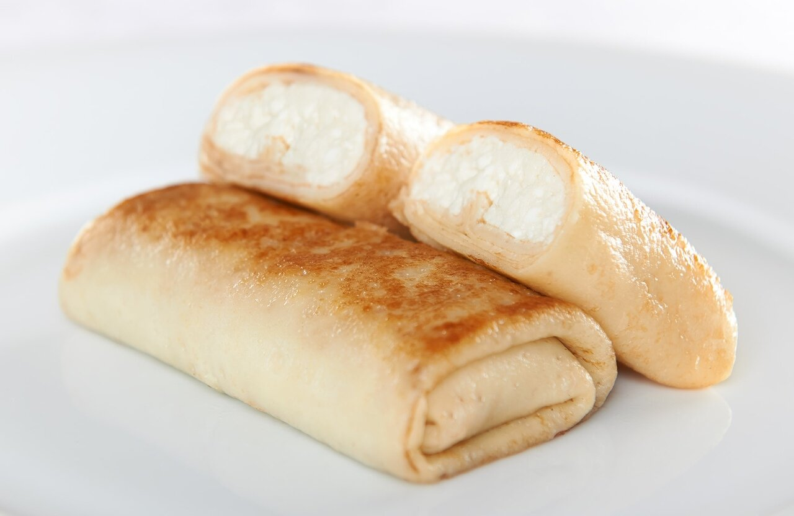
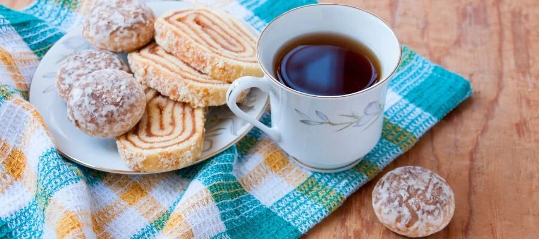

---
tags:
  - Инструкции
  - Личное
---

# Приготовление завтрака

Обычный завтрак соискателя Анатолия состоит из двух блюд:

1. [Блинчики с творогом](#pancake).
1. [Чай со вкусняшкой](#tea).

В данном руководстве описано, как Анатолию приготовить такой завтрак.

## Блинчики с творогом {#pancake}

!!! info

    Блинчики с творогом лучше есть, когда дети ушли в сад или заняты просмотром мультфильмов. В противном случае придется делиться.

1. Достаньте из морозилки три замороженных блинчика с творогом и положите их на среднюю тарелку. Если блинчиков с творогом в морозилке не оказалось:
	
	1. Скажите жене купить их при следующем походе в магазин.
	1. Перейдите к приготовлению [чая со вусняшкой](#tea).
	
1. Поставьте тарелку с блинчиками разогреваться на две минуты в микроволновую печь в автоматическом режиме.
1. После сигнала о завершении работы микроволновой печи достаньте тарелку с блинчиками, переверните их на другую сторону и поставьте разогреваться снова на две минуты в автоматическом режиме.
1. После второго сигнала о завершении работы микроволновой печи достаньте тарелку с блинчиками и убедитесь, что они достаточно разогрелись. Если нет — подогрейте ещё немного.
1. Поставьте тарелку с блинчиками на обеденный стол.
1. (Опционально) Положите на каждый блинчик немного сметаны.

## Чай со вкусняшкой {#tea}

1. Проверьте количество воды в чайнике:

	* Если воды достаточно — включите чайник.
	* Если недостаточно — долейте из маленького крана фильтрованной воды и только потом включите чайник.
	
1. Дождатесь, когда вода в чайнике закипит, а чайник выключится.
1. Возьмите кружку и налейте в неё немного заварки из заварочного чайника. Если заварка закончилась — сделайте новую, добавив кипятка из чайника в заварочный чайник.
1. Налейте в кружку кипятка из чайника, оставив немного места для холодной воды.
1. Долейте в кружку холодной фильтрованной воды из маленького крана, чтобы получилась целая кружка чая.
1. Достаньте из шкафа вкусняшку и положите вместе с кружкой чая на обеденный стол.
