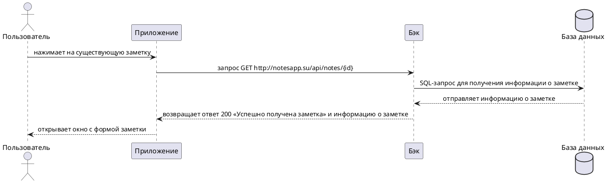

---
tags:
  - Сценарии
  - notesapp
---

# Пользовательский сценарий «Просмотр заметки»

## Действующие лица:

1. Пользователь
1. Приложение
1. Бэк
1. База данных

## Предварительные условия

1. Пользователь должен находиться на главном экране.
1. В системе должна быть хотя бы одна существующая заметка.

## Выходные условия

В системе открылась форма заметки.

## Основной сценарий

1. Пользователь нажимает на существующую заметку.
1. Приложение отправляет запрос Бэку `GET http://notesapp.su/api/notes/{id}` на получение информации о заметке.
1. Бэк отправляет SQL-запрос в Базу данных для получения информации о заметке
1. База данных отправляет Бэку информацию о заметке из Базы данных.
1. Бэк возвращает Приложению ответ `200` «Успешно получена заметка» и информацию о заметке.
1. Приложение открывает окно с формой заметки.

### Диаграмма последовательности



??? note "Код диаграммы"
    @startuml
    skinparam {
    sequenceMessageAlignment center
    }

    actor Пользователь as user
    participant Приложение as app
    participant Бэк as back
    database "База данных" as db

    user -> app: нажимает на существующую заметку
    app -> back: запрос GET http://notesapp.su/api/notes/{id}
    back -> db: SQL-запрос для получения информации о заметке
    back <-- db: отправляет информацию о заметке
    app <-- back: возвращает ответ 200 «Успешно получена заметка» и информацию о заметке
    user <-- app: открывает окно с формой заметки

    @enduml
    ```