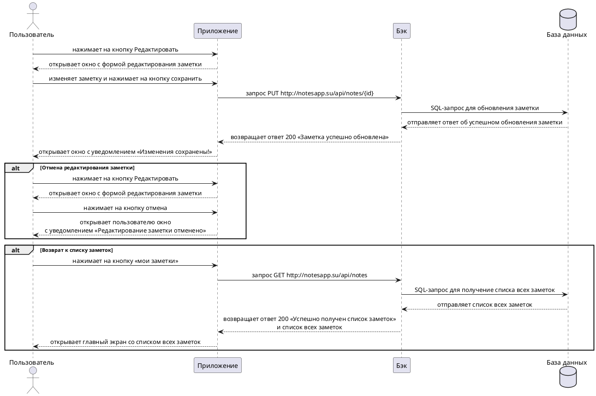

---
tags:
  - Сценарии
  - notesapp
---

# Пользовательский сценарий «Редактирование заметки»

## Действующие лица:

1. Пользователь
1. Приложение
1. Бэк
1. База данных

## Предварительные условия

1. В системе должна быть хотя бы одна существующая заметка.
1. Пользователь должен находиться в форме заметки.

## Выходные условия

Существующая в системе заметка отредактировалась.

## Основной сценарий

1. Пользователь нажимает на кнопку **Редактировать**.
1. Приложение открывает окно с формой редактирования заметки.
1. Пользователь изменяет заметку.
1. Пользователь нажимает на кнопку **сохранить**.
1. Приложение отправляет запрос Бэку `PUT http://notesapp.su/api/notes/{id}` на обновление заметки.
1. Бэк отправляет SQL-запрос в Базу данных для обновления заметки.
1. База данных отправляет Бэку ответ об успешном обновления заметки.
1. Бэк возвращает Приложению ответ `200` «Заметка успешно обновлена».
1. Приложение открывает пользователю окно с уведомлением «Изменения сохранены!».

## Альтернативный сценарий №1

1. Пользователь нажимает на кнопку **мои заметки**.
1. Приложение отправляет запрос Бэку `GET http://notesapp.su/api/notes` на получение списка всех заметок.
1. Бэк отправляет SQL-запрос в Базу данных для получение списка всех заметок.
1. База данных отправляет Бэку список всех заметок.
1. Бэк возвращает Приложению ответ `200` «Успешно получен список заметок» и список всех заметок.
1. Приложение отображает главный экран со списком всех заметок.

## Альтернативный сценарий №2

1. Пользователь нажимает на кнопку **Редактировать**.
1. Приложение открывает окно с формой редактирования заметки.
1. Пользователь нажимает на кнопку **отмена**.
1. Приложение открывает пользователю окно с уведомлением «Редактирование заметки отменено».

### Диаграмма последовательности



??? note "Код диаграммы"
    ```plantuml
    @startuml
    skinparam {
    sequenceMessageAlignment center
    }

    actor Пользователь as user
    participant Приложение as app
    participant Бэк as back
    database "База данных" as db

    user -> app: нажимает на кнопку Редактировать
    user <-- app: открывает окно с формой редактирования заметки
    user -> app: изменяет заметку и нажимает на кнопку сохранить
    app -> back: запрос PUT http://notesapp.su/api/notes/{id}
    back -> db: SQL-запрос для обновления заметки
    back <-- db: отправляет ответ об успешном обновления заметки
    app <-- back: возвращает ответ 200 «Заметка успешно обновлена»
    user <-- app: открывает окно с уведомлением «Изменения сохранены!»

    alt Отмена редактирования заметки
    user -> app: нажимает на кнопку Редактировать
    user <-- app: открывает окно с формой редактирования заметки
    user -> app: нажимает на кнопку отмена
    user <-- app: открывает пользователю окно\nс уведомлением «Редактирование заметки отменено»
    end alt

    alt Возврат к списку заметок
    user -> app: нажимает на кнопку «мои заметки»
    app -> back: запрос GET http://notesapp.su/api/notes
    back -> db: SQL-запрос для получение списка всех заметок
    back <-- db: отправляет список всех заметок
    app <-- back: возвращает ответ 200 «Успешно получен список заметок»\nи список всех заметок
    user <-- app: открывает главный экран со списком всех заметок
    end alt

    @enduml
    ```