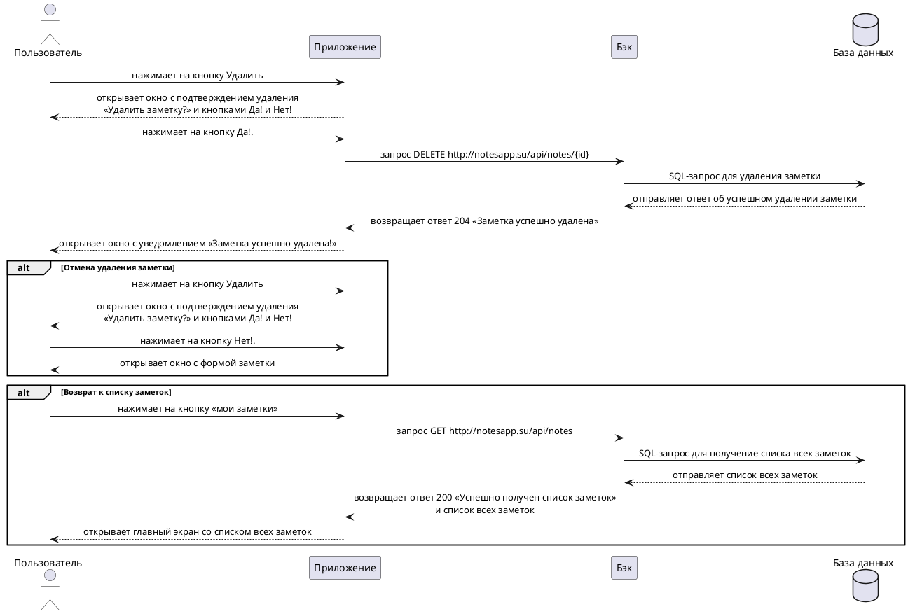

---
tags:
  - Сценарии
  - notesapp
---

# Пользовательский сценарий «Удаление заметки»

## Действующие лица:

1. Пользователь
1. Приложение
1. Бэк
1. База данных

## Предварительные условия

1. В системе должна быть хотя бы одна существующая заметка.
1. Пользователь должен находиться в форме заметки.

## Выходные условия

Существующая в системе заметка удалилась.

## Основной сценарий

1. Пользователь нажимает на кнопку **Удалить**.
1. Приложение открывает пользователю окно с подтверждением удаления «Удалить заметку?» и кнопками **Да!** и **Нет!**.
1. Пользователь нажимает на кнопку **Да!**.
1. Приложение отправляет запрос Бэку `DELETE http://notesapp.su/api/notes/{id}` на удаление заметки.
1. Бэк отправляет SQL-запрос в Базу данных для удаления заметки.
1. База данных отправляет Бэку ответ об успешном удалении заметки.
1. Бэк возвращает Приложению ответ `204` «Заметка успешно удалена».
1. Приложение открывает пользователю окно с уведомлением «Заметка успешно удалена!».

## Альтернативный сценарий №1
1. Пользователь нажимает на кнопку **Удалить**.
1. Приложение открывает пользователю окно с подтверждением удаления «Удалить заметку?» и кнопками **Да!** или **Нет!**.
1. Пользователь нажимает на кнопку **Нет!**.
1. Приложение открывает пользователю окно с формой заметки.

## Альтернативный сценарий №2

1. Пользователь нажимает на кнопку **мои заметки**.
1. Приложение отправляет запрос Бэку `GET http://notesapp.su/api/notes` на получение списка всех заметок.
1. Бэк отправляет SQL-запрос в Базу данных для получение списка всех заметок.
1. База данных отправляет Бэку список всех заметок.
1. Бэк возвращает Приложению ответ `200` «Успешно получен список заметок» и список всех заметок.
1. Приложение отображает главный экран со списком всех заметок.

### Диаграмма последовательности



??? note "Код диаграммы"
    @startuml
    skinparam {
    sequenceMessageAlignment center
    }

    actor Пользователь as user
    participant Приложение as app
    participant Бэк as back
    database "База данных" as db

    user -> app: нажимает на кнопку Удалить
    user <-- app: открывает окно с подтверждением удаления\n«Удалить заметку?» и кнопками Да! и Нет!
    user -> app: нажимает на кнопку Да!.
    app -> back: запрос DELETE http://notesapp.su/api/notes/{id}
    back -> db: SQL-запрос для удаления заметки
    back <-- db: отправляет ответ об успешном удалении заметки
    app <-- back: возвращает ответ 204 «Заметка успешно удалена»
    user <-- app: открывает окно с уведомлением «Заметка успешно удалена!»

    alt Отмена удаления заметки
    user -> app: нажимает на кнопку Удалить
    user <-- app: открывает окно с подтверждением удаления\n«Удалить заметку?» и кнопками Да! и Нет!
    user -> app: нажимает на кнопку Нет!.
    user <-- app: открывает окно с формой заметки
    end alt

    alt Возврат к списку заметок
    user -> app: нажимает на кнопку «мои заметки»
    app -> back: запрос GET http://notesapp.su/api/notes
    back -> db: SQL-запрос для получение списка всех заметок
    back <-- db: отправляет список всех заметок
    app <-- back: возвращает ответ 200 «Успешно получен список заметок»\nи список всех заметок
    user <-- app: открывает главный экран со списком всех заметок
    end alt

    @enduml
    ```